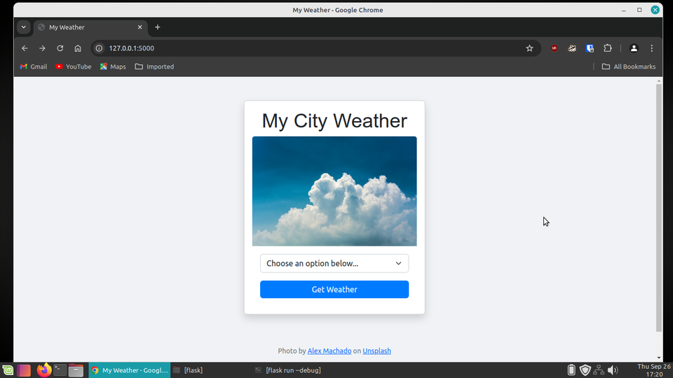
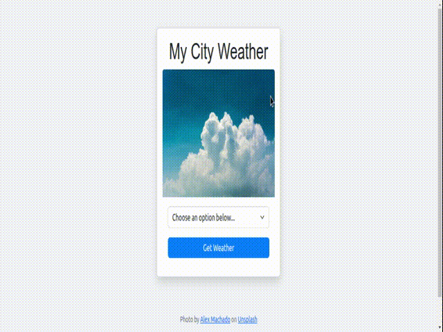

# Flask Weather App

This is a simple weather app that retrieves weather information from the openweather api.



## Overview

The aim of this app is to display different capital cities weather. Although the data used for input is not exhaustive, it is still enough to show the simplicity and difficult elements of the app. The app is build with the flask framework as backend, and bootstrap for frontend. I hope you find motivation especially as a python beginner, and just build stuff.

To run the weather app in your local environment:
1. Clone the repository:

```bash
   $ git clone https://github.com/flask_weather_app.git
   $ cd flask_weather_app
```
2. Create and activate virtual environment:

```bash
   # Linux
   $ python3 -m venv .venv
   $ source .venv/bin/activate
```
3. Install requirements:

```bash
   $ pip install -r requirements.txt
```
4. Run the application

```bash
   $ export FLASK_APP=app.py
   $ flask run --debug
```

5. Check the flask app running on <127.0.0.1:500>

---



